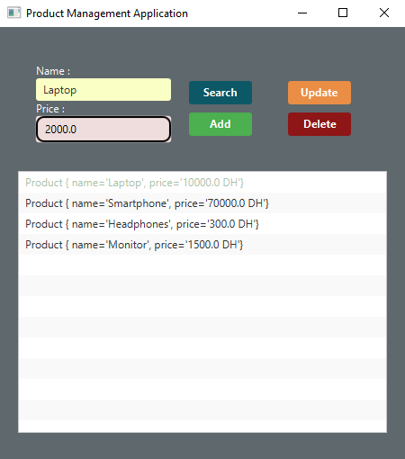

# Activité Pratique d'une application JavaFX 

Ce dépôt contient la solution de l'activité pratique axée sur une application JavaFX pour la gestion des produits. Ce TP fait partie du cours de Java Avancé dirigé par M. Abdelmajid Bousselham.

## Aperçu d'application

### Exercice 1 : Multi-Threading avec `Runnable`

- **Objectif** : Créer une application JavaFX qui permet de gérer les produits. 
- **L'application se compose des éléments suivants :** :
  1. Une classe `Product` avec deux attributs name et price, des constructeurs, des getters, des setters et la méthode `toString`.
  2. Créer la vue `product-view` qui affiche un formulaire et une listeview pour afficher les produits.
  3. Créer le controlleur `ProuctController` qui réponds aux actions de l'utilisateur.
  4. Créer une `feuille de style` css à appliquer sur l'interface graphique.
  5. Créer une classe application avec la méthode start pour démarer l'application.
- **Résultat Attendu** : Gérer une liste de produits en ajoutant, affichant, recherchant, modifiant et supprimant des produits via une interface graphique stylisée..
- **Execution**: <br><br>
    
    
    
    
    
    
    
    
    
 <hr>
 <br>
<br>

   
## Comment Exécuter

1. Cloner le dépôt :
   ```bash
   git clone https://github.com/ouss-issib/practical-activity-java-fx.git

2. Naviguer dans le répertoire du dépôt :
   ```bash
   cd practical-activity-java-fx

3. Compiler et exécuter les fichiers Java :
   ```bash
    mvn clean install
    mvn javafx:run


